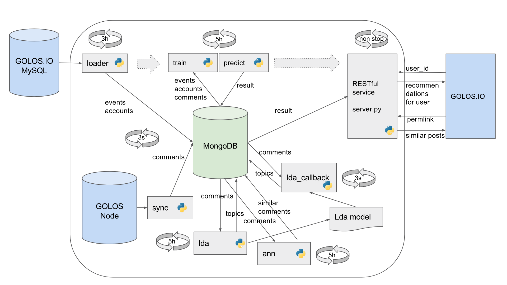

# Golos.io recommendation system

This repo contains files of recommendation system for golos.io

```
.
+-- gdisk - tool to download first version of model from google drive 
+-- server.py - Flask server for recommendation system
+-- sync
   +-- convert_events.py - Convert events in MongoDB for training FFM model
   +-- sync_comments.py - Synchronizing MongoDB with Golos node
   +-- sync_events.py - Synchronizing Golosio MySQL with MongoDB
+-- model
   +-- utils.py - Helpers for preprocessing, processes regulation and etc.
   +-- ann.py - Process of finding similar posts
   +-- doc2vec.py - Process of finding doc2vec vectors for each post
   +-- train.py - Process of training FFM model
   +-- predict.py - Process of creating predictions
```
# Installation

Install LibFFM before usage. Instruction can be found here: http://github.com/alexeygrigorev/libffm-python

Prepare mongo database before installation. You can load current mongo dumps here:
```bash
$ scp earth@earth.cyber.fund:~/Documents/golosio-recommendation-model/golosio-recommendation-dump-comment.json ./
$ scp earth@earth.cyber.fund:~/Documents/golosio-recommendation-model/golosio-recommendation-dump-event.json ./
```

To load comments from golos node, run:
```bash
$ python3 ./sync/sync_comments.py NODE_WS_URL
```

To load events to a mongo database from mysql database, use this sql to create csv:
```sql
SELECT user_id, event_type, value, refurl, created_at
FROM golos.web_events 
WHERE 
	(event_type = "Comment" OR event_type = "Vote" OR event_type = "PageView") 
   AND created_at < CURDATE()
   AND created_at >  CURDATE() - INTERVAL 1 DAY
INTO OUTFILE 'PATH_TO_CSV'
FIELDS TERMINATED BY ',' 
ENCLOSED BY '"';
```
Then use created file in these scripts:
```bash
$ python3 ./sync/sync_events.py MONGO_HOST:MONGO_PORT MONGO_DATABASE PATH_TO_CSV
$ python3 ./sync/convert_events.py MONGO_HOST:MONGO_PORT MONGO_DATABASE
```

To add tasks for model rebuild to a cron tab, use:
```bash
$ install.sh DATABASE_HOST:DATABASE_PORT DATABASE_NAME
```

For example:
```bash
$ install.sh localhost:27017 golos_comments
```

To remove tasks from cron tab, run:
```bash
$ uninstall.sh
```
# Architecture

Recommendation model architecture: 

# How to use it

To start server, run:
```bash
$ run.sh DATABASE_HOST:DATABASE_PORT DATABASE_NAME
```

For example:
```bash
$ run.sh localhost:27017 steemdb_1
```

To get supported user ids, run
```bash
$ curl http://localhost:8080/users
```

To get history for some user, run:
```bash
$ curl http://localhost:8080/history?user=USER_ID
```

For example:
```bash
$ curl http://localhost:8080/history?user=58158

[
  "@vik/test-redaktora-dlya-botov-ot-vik-11-10", 
  "@vox-populi/otchyot-kuratora-30-oktyabrya-5-noyabrya", 
  "@vp-freelance/4kpmi-rezultaty-ezhenedelnogo-konkursa-luchshaya-rabota-po-itogam-nedeli", 
  "@vp-freelance/khudozhestvennyi-perevod", 
  "@vp-freelance/konkursnaya-rabota-16-odnazhdy-na-rabote-ikra-belugi", 
  "@vp-freelance/realnosti-frilansa-mysli", 
  "@vp-freelance/rezultaty-konkursa-odnazhdy-na-rabote-za-oktyabr-2017-goda", 
  "@vp-freelance/treiding-kak-vid-frilansa"
]
```

To get similar posts and distances to each of them for a specified one, run:
```bash
$ curl http://localhost:8080/similar?permlink=POST_PERMLINK
```

For example:

```bash
$ curl http://localhost:8080/similar?permlink=@gryph0n/podarochnyi-byteball

{
  "@cryptojournal/bitpay-privlek-usd30-mln-v-ramkakh-finansirovaniya-serii-v": 0.0, 
  "@cryptojournal/podrobnosti-obvala-na-krupneishei-v-mire-kriptovalyutnoi-birzhe-bitfinex": 0.0, 
  "@ecoinmateus/relay-race11": 0.0, 
  "@itsynergis/primer-socialnogo-blokcheina": 0.0, 
  "@ituber/nem-obyavili-o-partnerstve-s-loyalcoin": 0.0, 
  "@ituber/token-zcoin-dobavili-na-birzhu-bx-thailand": 0.0, 
  "@liketerryfox/obzor-ico-57-sola-foundation-27-november-17-00-mck": 0.0, 
  "@sibr.hus/summa-deneg-znachitelno-bolshaya-chem-mozhet-sobrat-etot-post-naidenaya-na-progulke": 0.0, 
  "@the1arty/aventus-kakie-uslugi-vklyuchaet-v-sebya-platforma": 0.0, 
  "@vesti/12-saitov-po-besplatnoi-razdache-altkoinov": 0.0
}
```

To get recommendations for specified user, run:
```bash
curl http://localhost:8080/recommendations?user=USER_ID
```

For example:
```bash
$ curl http://localhost:8080/recommendations?user=58158

[
  {
    "post_permlink": "@tarimta/obektivnyi-marafon-etap-3", 
    "prediction": 0.9400154948234558
  }, 
  {
    "post_permlink": "@lumia/estafeta-prodolzhi-pesnyu-zadushevnaya", 
    "prediction": 0.9309653043746948
  }, 
  {
    "post_permlink": "@oksi969/dizain-cheloveka-lyubov-i-napravlenie-g-centr", 
    "prediction": 0.9016984701156616
  }, 
  {
    "post_permlink": "@is-pain/vzveshennye-lyudi-or-minus-16-kilogramm-za-dva-mesyaca", 
    "prediction": 0.8760964870452881
  }, 
  {
    "post_permlink": "@miroslav/golos-photography-awards-edinstvennaya", 
    "prediction": 0.8590876460075378
  },
  ...
]

```

# Configuration

You can change service port here:

```python
# server.py
port = 8080 # Use desired port
```

Play with constansts to change time window for recommended posts and number of recommendations for each user

```python
# model/predict.py
USERS_POSTS_LIMIT = 100 # Max number of recommendations
HOURS_LIMIT = 30 * 24 # Time window for recommended posts
```

# Tests and logs

To run load tests, download first version of a model and use:
```bash
python3 -m unittest tests.load_test_case
```

It'll show average response time for actions that returns recommendations and similar posts.

To see model logs, run:
```bash
tail -f ./model.log
```

# Timing

- lda - 1.5h
- doc2vec - 1.5h
- ann - 1h
- train - 5h
- predict - 2.5h
